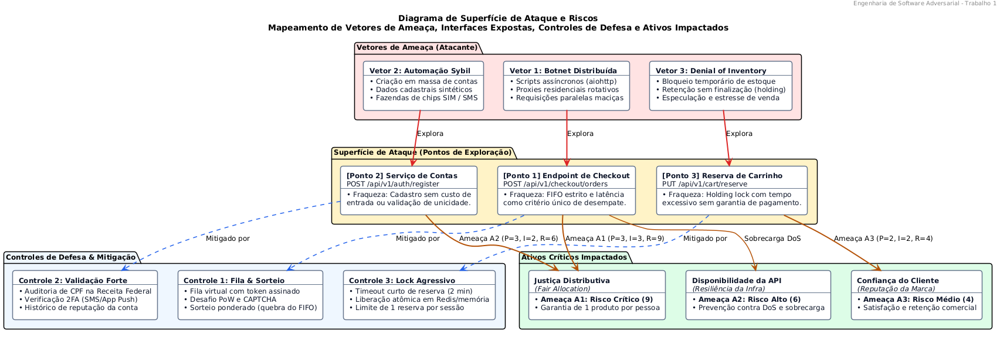

# Trabalho 1 - Análise de um Sistema Adversarial
## Modelo estático, modelo dinâmico, ameaças e riscos

* **Link da Apresentação em Slides (PDF):** [Inserir link do Google Drive aqui]
* **Link do Vídeo de Apresentação (YouTube / gravado via Canva):** [Inserir link do YouTube aqui]

---

### Integrantes do Grupo

| Nome Completo | Matrícula |
|---|---|
| Artur Wahlbrink Kraemer | |
| Fade Hassan Husein Kanaan | |
| Gabriel Camargo Ortiz | |
| Rodrigo Thoma da Silva | 2510100608 |

---

## 1. Proposta

> **Questão central:** O que torna esse sistema adversarial, como os participantes tomam decisões e como a interação evolui ao longo das rodadas?

Este trabalho analisa a interação de **publicar e calcular avaliações de estabelecimentos** (nota de 1 a 5 estrelas e comentário) em plataformas como marketplaces e aplicativos de delivery.

### Por que o sistema é adversarial?

Existe um conflito de interesse direto entre os participantes:
* **Estabelecimentos comerciais maliciosos:** Dependem de uma nota alta para ter visibilidade e faturar mais. Por isso, têm incentivo para fraudar o sistema comprando avaliações falsas positivas para si (*astroturfing*) ou negativas para concorrentes (*review bombing*).
* **A plataforma:** Precisa que as notas reflitam a realidade para manter a confiança dos consumidores. Se notas altas indicarem lugares ruins, os usuários abandonam o serviço.

### Como os participantes tomam decisões?

Ambos os lados agem estrategicamente avaliando custos e ganhos:
* O estabelecimento fraudador avalia o custo de criar contas ou pagar por avaliações falsas contra o ganho financeiro de subir sua nota sem ser banido.
* A plataforma decide o rigor dos seus filtros de bloqueio e de cálculo da média, buscando barrar fraudes sem punir ou desmotivar clientes legítimos com regras excessivas (evitando falsos positivos).

### Como a interação evolui ao longo das rodadas?

A disputa ocorre em ciclos de ação, observação e adaptação:
1. O fraudador publica avaliações falsas para inflar sua média.
2. O sistema detecta o padrão e descarta as avaliações ou penaliza a conta.
3. O fraudador observa a resposta da plataforma e adapta sua tática (ex.: varia os textos, espaça os envios no tempo ou usa contas mais antigas).
4. O sistema aprimora suas defesas, gerando uma corrida contínua de adaptações.

---

## 2. Escolha do Sistema

*[Indicar o sistema escolhido e a interação específica analisada. Atenção: não analisar um domínio inteiro, mas sim uma interação específica, como publicar uma avaliação, comprar um ingresso, reservar um horário ou receber uma recompensa.]*

* **Sistema escolhido:** 
* **Interação específica delimitada:** 
* **Justificativa da escolha atendendo aos critérios:**
  1. *Pelo menos dois participantes capazes de tomar decisões:*
  2. *Objetivos total ou parcialmente conflitantes:*
  3. *Uma regra, métrica ou decisão que possa ser explorada:*
  4. *Alguma resposta observável que permita reação ou adaptação:*
  5. *Escopo suficientemente pequeno para ser implementado no Trabalho 2:*

---

## 3. Desenvolvimento

### 3.1 Descrição do Sistema Adversarial

* **Qual é o sistema e qual interação será analisada:**
* **Quais são os principais atores:**
* **Qual é o objetivo de cada ator:**
* **Qual ativo ou propriedade precisa ser preservado (justiça, confiança, privacidade, disponibilidade, distribuição correta de um recurso, etc.):**
* **Quais ações ou capacidades cada ator possui:**
* **Quais informações cada ator consegue observar:**
* **Quais custos ou restrições limitam suas ações:**
* **Pelo menos dois pressupostos dos quais o sistema depende:**
  1. *Pressuposto 1:*
  2. *Pressuposto 2:*
* **Como esses pressupostos podem falhar:**
  1. *Falha do Pressuposto 1:*
  2. *Falha do Pressuposto 2:*

#### Tabela de Atores

| Ator | Objetivo | Ações ou capacidades | Informações observáveis | Restrições ou custos |
|---|---|---|---|---|
| Ator 1 | | | | |
| Ator 2 | | | | |

#### Diagrama de Contexto

#### Natureza Adversarial do Caso

*[Explicar por que o caso representa uma situação adversarial, e não apenas um erro ou acidente.]*

---

### 3.2 Modelo Estratégico Estático

#### Matriz de Decisão (Jogo 2x2)

> Ordem dos payoffs no par: `(payoff do Jogador A, payoff do Jogador B)`  
> Valores utilizados: escala de preferência simples (ex.: 0, 1, 2, 3)

| Jogador A \ Jogador B | Ação B1: *[Nome da Ação]* | Ação B2: *[Nome da Ação]* |
|---|:---:|:---:|
| **Ação A1: *[Nome da Ação]*** | ( , ) | ( , ) |
| **Ação A2: *[Nome da Ação]*** | ( , ) | ( , ) |

#### Análise do Modelo Estático

* **O que representa cada ação:**
  * *Ação A1:*
  * *Ação A2:*
  * *Ação B1:*
  * *Ação B2:*
* **Por que cada resultado recebeu aqueles payoffs:**
  * *(A1, B1):*
  * *(A1, B2):*
  * *(A2, B1):*
  * *(A2, B2):*
* **Quais são as melhores respostas dos jogadores:**
  * *Melhores respostas do Jogador A:*
  * *Melhores respostas do Jogador B:*
* **Existe estratégia dominante?**
* **Existe um resultado no qual nenhum jogador melhora mudando sozinho (Equilíbrio de Nash)?**
* **Esse resultado é bom para o sistema e para os usuários legítimos?**

---

### 3.3 Modelo Estratégico Dinâmico

#### Ciclo de Rodadas Adversariais

| Rodada | Ação do participante | Resposta do sistema ou defensor | O que se torna observável? | Adaptação para a rodada seguinte |
|:---:|---|---|---|---|
| **1** | | | | |
| **2** | | | | |
| **3** | | | | |

#### Diagrama do Ciclo Adaptativo

#### Perguntas de Análise Dinâmica

* **Quem observa quem?**
* **O que cada lado consegue mudar?**
* **O que dispara uma adaptação?**
* **Qual é o custo da adaptação para cada lado?**
* **Em que ponto pode surgir uma corrida armamentista?**

---

### 3.4 Ameaças e Riscos

#### Diagrama de Superfície de Ataque

#### Pontos de Exploração Identificados
1. *Ponto de Exploração 1:*
2. *Ponto de Exploração 2:*
3. *Ponto de Exploração 3:*

#### Cenários de Ameaça

> **Formato padrão:**  
> *Um [ator] pode realizar [ação] por meio de [ponto de exploração], aproveitando [fraqueza ou pressuposto], causando [impacto] sobre [ativo ou propriedade].*

* **A1:** Um `[ator]` pode realizar `[ação]` por meio de `[ponto de exploração]`, aproveitando `[fraqueza ou pressuposto]`, causando `[impacto]` sobre `[ativo ou propriedade]`.
* **A2:** Um `[ator]` pode realizar `[ação]` por meio de `[ponto de exploração]`, aproveitando `[fraqueza ou pressuposto]`, causando `[impacto]` sobre `[ativo ou propriedade]`.
* **A3:** Um `[ator]` pode realizar `[ação]` por meio de `[ponto de exploração]`, aproveitando `[fraqueza ou pressuposto]`, causando `[impacto]` sobre `[ativo ou propriedade]`.

#### Avaliação de Riscos

> **Escala (1 a 3):**  
> * Probabilidade: 1 = baixa, 2 = média, 3 = alta  
> * Impacto: 1 = baixo, 2 = médio, 3 = alto  
> * Risco: $\text{Probabilidade} \times \text{Impacto}$

| ID | Cenário de ameaça | Ponto de exploração | Pressuposto ou fraqueza | Ativo afetado | Probabilidade (1-3) | Impacto (1-3) | Risco (1-9) |
|:---:|---|---|---|---|:---:|:---:|:---:|
| **A1** | | | | | | | |
| **A2** | | | | | | | |
| **A3** | | | | | | | |

#### Detalhamento da Ameaça de Maior Prioridade

* **Ameaça selecionada:**
* **Como o sistema poderia responder:**
* **Que informação essa resposta revelaria:**
* **Como o adversário poderia se adaptar na rodada seguinte:**
* **Quais efeitos colaterais poderiam atingir usuários legítimos:**
* **Qual risco continuaria existindo após a resposta (risco residual):**
* **O que o sistema precisa continuar preservando apesar das adaptações:**

---

## 4. Continuidade com o Trabalho 2

*[Descrever as decisões arquiteturais e o planejamento para transformar a especificação deste Trabalho 1 em uma implementação funcional de código no Trabalho 2.]*

---

## 5. Referências e Fontes Consultadas

*[Listar as principais referências bibliográficas e documentações técnicas utilizadas. O detalhamento completo pode ser mantido em [fontes/referencias.md](fontes/referencias.md).]*

---

## 6. Declaração sobre Uso de IA Generativa

*[Declarar para quais tarefas a IA generativa foi utilizada e descrever como o grupo verificou e validou o conteúdo produzido, conforme exigido na Seção 6 do enunciado.]*

---

## 7. Contribuições Individuais dos Integrantes

*[Descrever a divisão de trabalho e a contribuição de cada membro no repositório e na apresentação.]*

| Integrante | Papel / Responsabilidades | Seções Desenvolvidas |
|---|---|---|
| | | |
| | | |
| | | |
| | | |
| | | |
| | | |

---

## 8. Pergunta Final

> **"Depois que o sistema responder, o que o outro lado aprenderá e tentará fazer em seguida?"**

*[Inserir a resposta reflexiva do grupo à questão final do enunciado.]*

