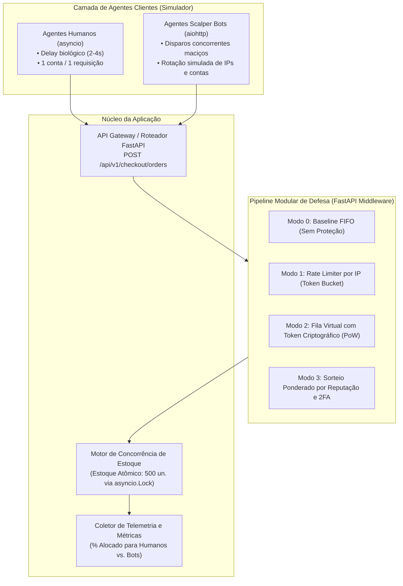

# Análise de um Sistema Adversarial
### Trabalho 1 — Modelo Estático, Modelo Dinâmico, Ameaças e Riscos

  <b>Engenharia de Software Adversarial</b> 
  <i>Etapa de Planejamento e Desenho Arquitetural para Implementação Funcional no Trabalho 2</i>

---

### 📌 Materiais de Apresentação

| Recurso | Formato / Plataforma | Link de Acesso |
| :--- | :---: | :--- |
| 📄 **Slides da Apresentação** | PDF (Google Drive) | *[Inserir link do Google Drive aqui]* |
| 🎥 **Vídeo de Apresentação** | YouTube (Gravação de Vídeo com Slides) | *[Inserir link do YouTube aqui]* |
| 📜 **Roteiro dos Slides e Falas** | Markdown | [fontes/roteiro_apresentacao_slides.md](fontes/roteiro_apresentacao_slides.md) |
| 📑 **Rascunho Base para Integrantes** | Markdown | [fontes/rascunho_completo_para_integrantes.md](fontes/rascunho_completo_para_integrantes.md) |

---

### 👥 Integrantes do Grupo e Divisão de Seções

| 👤 Nome Completo | Matrícula / Função Principal | Seções Atribuídas |
| :--- | :--- | :--- |
| **Rodrigo Thoma da Silva** | Proposta, Escolha do Sistema e Descrição Geral | **Seções 1, 2 e 3.1** |
| **Fade Hassan Husein Kanaan** | Modelo Estático (Teoria dos Jogos 2x2) e Arquitetura para o T2 | **Seções 3.2 e 4** |
| **Artur Wahlbrink Kraemer** | Modelo Dinâmico (Ciclo de 3 Rodadas) e Pergunta Final | **Seções 3.3 e 8** |
| **Gabriel Camargo Ortiz** | Superfície de Ataque, Cenários de Risco, IA e Referências | **Seções 3.4, 5, 6 e 7** |

---

## 1. Proposta

> 👤 **Responsável pelo desenvolvimento:** Rodrigo Thoma da Silva  
> 📝 *Rascunho base disponível para revisão e commit em [fontes/rascunho_completo_para_integrantes.md](fontes/rascunho_completo_para_integrantes.md)*

### Instruções para a Seção:
* Responder à questão central: *O que torna esse sistema adversarial, como os participantes tomam decisões e como a interação evolui ao longo das rodadas?*
* Delimitar a interação: **Checkout concorrente de produtos com estoque escasso em Flash Sales de Black Friday** (`POST /api/v1/checkout/orders` para 500 unidades).
* Detalhar o conflito direto entre **Operadores de Scalper Bots** (monopolização para revenda com ágio de 300%) e a **Plataforma de E-Commerce** (justiça distributiva de 1 un./CPF e resiliência de infraestrutura).
* Explicar como os participantes tomam decisões econômicas (custo de proxies vs. lucro de revenda) e como a interação evolui em corrida armamentista.

---

## 2. Escolha do Sistema

> 👤 **Responsável pelo desenvolvimento:** Rodrigo Thoma da Silva  
> 📝 *Rascunho base disponível para revisão e commit em [fontes/rascunho_completo_para_integrantes.md](fontes/rascunho_completo_para_integrantes.md)*

### Instruções para a Seção:
* Preencher a **Ficha Técnica da Interação** (Sistema Escolhido, Interação Específica e Contexto de Operação).
* Preencher a tabela de **Conformidade com os 5 Critérios Obrigatórios do Enunciado**:
  1. Pelo menos dois participantes capazes de tomar decisões;
  2. Objetivos total ou parcialmente conflitantes;
  3. Regra, métrica ou decisão explorável (latência de rede e política FIFO estrita);
  4. Resposta observável que permita reação ou adaptação (códigos HTTP, latência, tokens);
  5. Escopo viável para implementação no Trabalho 2.

---

## 3. Desenvolvimento

### 3.1 Descrição do Sistema Adversarial

> 👤 **Responsável pelo desenvolvimento:** Rodrigo Thoma da Silva  
> 📝 *Rascunho base disponível para revisão e commit em [fontes/rascunho_completo_para_integrantes.md](fontes/rascunho_completo_para_integrantes.md)*

### Instruções para a Seção:
* Descrever detalhadamente: o sistema e interação analisada, principais atores (Scalper, Plataforma e Consumidor Legítimo), objetivo de cada ator, ativos a preservar (Justiça Distributiva, Disponibilidade e Confiança), ações/capacidades, informações observáveis e custos/restrições.
* Descrever **pelo menos dois pressupostos** (Identidade Única e Latência Justa) e como eles falham (Ataque Sybil e Automação de Rede em Nuvem).
* Preencher a **Tabela de Atores** (com as 5 colunas obrigatórias).
* Incluir o **Diagrama de Contexto** (`diagramas/contexto.png` e código editável `diagramas/contexto.puml`).
* Explicar a **natureza adversarial do caso** (cálculo de extração de excedente econômico vs. erro acidental).

---

### 3.2 Modelo Estratégico Estático

> 👤 **Responsável pelo desenvolvimento:** Fade Hassan Husein Kanaan  
> ✅ **Status:** Concluído e Especificado

Para modelar a decisão central no instante de abertura da promoção relâmpago, definimos um jogo simultâneo em forma normal com dois jogadores e duas ações disponíveis para cada um:
* **Jogador A (Scalper):**
  * $A_1$ — **Flood de Bots Concorrentes:** Dispara automação em alta velocidade para capturar o maior número possível de unidades no instante de abertura.
  * $A_2$ — **Compra Manual / Humana:** Respeita a interface gráfica oficial e a cadência de interação humana comum.
* **Jogador B (Plataforma de E-Commerce):**
  * $B_1$ — **Checkout Direto FIFO (Sem Fricção):** Arquitetura tradicional orientada à máxima conversão e mínima latência, sem validações comportamentais pesadas ou filas de espera.
  * $B_2$ — **Fila Virtual Justa com Desafio de Integridade:** Mecanismo com sala de espera, análise de risco, desafio criptográfico e reserva controlada.

#### Matriz de Decisão (Jogo 2x2)

> **Ordem dos payoffs no par:** `(Payoff do Jogador A - Scalper, Payoff do Jogador B - Plataforma)`  
> **Escala ordinal de preferência:** `3` = Melhor resultado; `2` = Bom resultado; `1` = Resultado desfavorável; `0` = Pior resultado.

| Jogador A (Scalper) \ Jogador B (Plataforma) | $B_1$: Checkout Direto FIFO (Sem Fricção) | $B_2$: Fila Justa com Desafio de Integridade |
| :--- | :---: | :---: |
| **$A_1$: Flood de Bots Concorrentes** | $(3, 0)$ | $(\mathbf{1}, \mathbf{2})$ |
| **$A_2$: Compra Manual / Humana** | $(2, 3)$ | $(0, 1)$ |

#### Análise do Modelo Estático

* **O que representa cada ação:**
  * **$A_1$ (Flood de Bots):** Utilização de scripts automatizados de alta concorrência para submeter ordens de compra em milissegundos.
  * **$A_2$ (Compra Manual):** Submissão convencional via navegador ou app móvel, sujeita a tempos de reação e digitação humanos.
  * **$B_1$ (Checkout Direto FIFO):** Processamento imediato por ordem de chegada de pacotes de rede, priorizando velocidade de checkout e simplicidade arquitetural.
  * **$B_2$ (Fila Justa com Desafio):** Interposição de sala de espera virtual (*Waiting Room*), verificação de integridade e ordenação equitativa, reduzindo o impacto da velocidade pura.

* **Por que cada resultado recebeu aqueles payoffs:**
  * **$(A_1, B_1) \rightarrow (3, 0)$:** 
    * *Scalper (3):* Conquista o melhor resultado possível. Os bots arrematam 100% do estoque promocional em milissegundos com custo operacional mínimo de evasão, garantindo lucro máximo de revenda no mercado secundário.
    * *Plataforma (0):* Sofre o pior desfecho. O estoque é liquidado para especuladores, clientes reais ficam frustrados e acusam o evento de propaganda enganosa nas redes sociais, e a infraestrutura enfrenta sobrecarga severa de requisições.
  * **$(A_1, B_2) \rightarrow (1, 2)$:** 
    * *Scalper (1):* A maioria dos bots fica retida na fila virtual ou é barrada pelos desafios; para manter chances de sucesso, o atacante precisa gastar recursos financeiros com proxies caros e solvers de CAPTCHA, obtendo apenas uma fração do estoque.
    * *Plataforma (2):* Bloqueia o ataque massivo e distribui a maior parte das unidades a consumidores legítimos, preservando sua reputação, embora arque com custos de infraestrutura e aumente a latência percebida do checkout.
  * **$(A_2, B_1) \rightarrow (2, 3)$:** 
    * *Scalper (2):* O operador tenta comprar como um consumidor comum e possui chance razoável e honesta de obter o produto pelo preço promocional com esforço mínimo.
    * *Plataforma (3):* Cenário idílico de máxima utilidade. Custo computacional reduzido (sem servidores de fila ou WAF complexo), taxa de conversão altíssima e compradores autênticos satisfeitos.
  * **$(A_2, B_2) \rightarrow (0, 1)$:** 
    * *Scalper (0):* O comprador manual sofre com longas salas de espera, atrito de desafios e alta concorrência, tendo baixa chance de sucesso.
    * *Plataforma (1):* Mantém uma infraestrutura de segurança cara e pesada que gera atrito desnecessário para uma base de clientes que nem sequer estava utilizando ferramentas automatizadas.

* **Quais são as melhores respostas dos jogadores:**
  * **Melhores respostas do Jogador A (Scalper):**
    * Se a Plataforma escolhe $B_1$ (Checkout Direto), o Scalper compara $A_1$ (payoff 3) com $A_2$ (payoff 2). A melhor resposta é **$A_1$** ($3 > 2$).
    * Se a Plataforma escolhe $B_2$ (Fila Justa), o Scalper compara $A_1$ (payoff 1) com $A_2$ (payoff 0). A melhor resposta é **$A_1$** ($1 > 0$).
  * **Melhores respostas do Jogador B (Plataforma):**
    * Se o Scalper escolhe $A_1$ (Flood de Bots), a Plataforma compara $B_1$ (payoff 0) com $B_2$ (payoff 2). A melhor resposta é **$B_2$** ($2 > 0$).
    * Se o Scalper escolhe $A_2$ (Compra Manual), a Plataforma compara $B_1$ (payoff 3) com $B_2$ (payoff 1). A melhor resposta é **$B_1$** ($3 > 1$).

* **Existe estratégia dominante?**
  **Sim.** Para o Jogador A (Scalper), a ação **$A_1$ (Flood de Bots Concorrentes)** é uma **estratégia estritamente dominante**. Independentemente de a plataforma adotar checkout direto sem defesas ($B_1$) ou uma fila com desafios de segurança ($B_2$), o atacante obtém um payoff estritamente maior utilizando automação do que submetendo manualmente ($3 > 2$ e $1 > 0$). O scalper racional sempre escolherá automatizar.

* **Existe um resultado no qual nenhum jogador melhora mudando sozinho (Equilíbrio de Nash)?**
  **Sim.** O par de estratégias **$(A_1, B_2)$**, correspondente ao desfecho com payoffs **$(1, 2)$**, é o **único Equilíbrio de Nash em estratégias puras** deste jogo.  
  * *Verificação de estabilidade:* Dado que o Scalper joga $A_1$, a Plataforma não tem incentivo para desviar unilateralmente para $B_1$ (seu payoff cairia de 2 para 0). Dado que a Plataforma joga $B_2$, o Scalper não tem incentivo para desviar unilateralmente para $A_2$ (seu payoff cairia de 1 para 0). Nenhum jogador melhora sua recompensa mudando de estratégia isoladamente.

* **Esse resultado é bom para o sistema e para os usuários legítimos?**
  **Não. Trata-se de um equilíbrio ineficiente segundo o critério de Pareto**, análogo à armadilha do *Dilema do Prisioneiro*:
  * O ótimo social cooperativo ocorreria em $(A_2, B_1)$, onde a soma total de utilidade dos participantes seria $5$ ($2 + 3$). Nesse ponto idílico, todos compram manualmente sem custos de defesa ou ataques.
  * No entanto, como a tentação de trapacear é estritamente dominante para o scalper, o sistema é arrastado para o equilíbrio estável de segurança em $(A_1, B_2)$, onde a soma de payoffs cai para $3$ ($1 + 2$).
  * Para a plataforma, isso impõe custos perenes de infraestrutura de mitigação e licenciamento de softwares anti-bot. Para os **usuários legítimos**, esse equilíbrio acarreta efeitos colaterais indesejados: salas de espera obrigatórias, maior tempo de checkout, necessidade de resolução de CAPTCHAs invasivos e a frustração de perder compras mesmo cumprindo todas as regras de boa-fé.

---

### 3.3 Modelo Estratégico Dinâmico

> 👤 **Responsável pelo desenvolvimento:** Artur Wahlbrink Kraemer  
> 📝 *Rascunho base disponível para revisão e commit em [fontes/rascunho_completo_para_integrantes.md](fontes/rascunho_completo_para_integrantes.md)*

### Instruções para a Seção:
* Representar pelo menos **três rodadas consecutivas** no ciclo: *Ação $\rightarrow$ Resposta $\rightarrow$ Observação $\rightarrow$ Adaptação*:
  * **Rodada 1:** Força bruta de requisições via VPS $\rightarrow$ Rate Limiting por IP (HTTP 429) $\rightarrow$ Adaptação para proxies residenciais rotativos;
  * **Rodada 2:** Pulverização de IPs $\rightarrow$ Fila Virtual com Token Criptográfico (PoW/CAPTCHA) $\rightarrow$ Adaptação para navegadores headless e solvers de IA;
  * **Rodada 3:** Guerra de latência $\rightarrow$ Quebra do FIFO com Sorteio Ponderado por Reputação e 2FA $\rightarrow$ Adaptação para fazendas de identidades reais e SMS (inviabilidade econômica).
* Incluir o **Diagrama do Ciclo Adaptativo** (`diagramas/ciclo-adaptativo.png` e código editável `diagramas/ciclo-adaptativo.puml`).
* Responder às 5 perguntas de dinâmica adversarial:
  1. *Quem observa quem?*
  2. *O que cada lado consegue mudar?*
  3. *O que dispara uma adaptação?*
  4. *Qual é o custo da adaptação para cada lado?*
  5. *Em que ponto pode surgir uma corrida armamentista?*

---

### 3.4 Ameaças e Riscos

> 👤 **Responsável pelo desenvolvimento:** Gabriel Camargo Ortiz  
> 📝 *Rascunho base disponível para revisão e commit em [fontes/rascunho_completo_para_integrantes.md](fontes/rascunho_completo_para_integrantes.md)*

### Instruções para a Seção:
* Incluir o **Diagrama de Superfície de Ataque** (`diagramas/superficie-de-ataque.png` e código editável `diagramas/superficie-de-ataque.puml`).
* Identificar e detalhar **3 Pontos de Exploração** (Endpoint de Checkout, Serviço de Cadastro e Reserva Temporária de Estoque).
* Formular **3 Cenários de Ameaça** utilizando rigorosamente o template do enunciado:
  * *Um [ator] pode realizar [ação] por meio de [ponto de exploração], aproveitando [fraqueza ou pressuposto], causando [impacto] sobre [ativo ou propriedade].*
* Construir a **Tabela de Avaliação de Riscos** ($P \times I = R$) com escala de 1 a 3.
* Detalhar exaustivamente a **Ameaça Prioritária (A1 — Risco 9)** respondendo:
  * Como o sistema responde;
  * Que informação a resposta revela;
  * Como o adversário se adapta;
  * Efeitos colaterais em usuários legítimos (fricção, latência e ansiedade);
  * Risco residual;
  * O que o sistema precisa continuar preservando.

---

## 4. Continuidade com o Trabalho 2: Planejamento Arquitetural

> 👤 **Responsável pelo desenvolvimento:** Fade Hassan Husein Kanaan  
> ✅ **Status:** Concluído e Especificado

Este Trabalho 1 funciona como a especificação de requisitos e desenho conceitual para a **implementação funcional que será desenvolvida no Trabalho 2**.

### Decisões Arquiteturais Concretas para a Implementação no Trabalho 2:
1. **Linguagem e Stack Tecnológica:**
   * Backend em **Python 3.11+ utilizando FastAPI e Uvicorn**, aproveitando o ecossistema assíncrono nativo (`asyncio`) para gerenciar centenas de conexões simultâneas com baixo consumo de memória.
2. **Componente de Controle de Concorrência de Estoque (`InventoryEngine`):**
   * O estoque promocional (500 unidades) será gerenciado em memória através de operações atômicas protegidas por um primitivo `asyncio.Lock` (ou estrutura simulada em Redis), prevenindo condições de corrida (*race conditions* e *overselling*).
3. **Pipeline Modular de Defesas Comutáveis (`DefensePipeline`):**
   * A aplicação contará com um mecanismo de alternância de estratégias de mitigação via variáveis de ambiente ou flags de configuração, permitindo demonstrar empiricamente a transição entre as rodadas:
     * `DEFENSE_MODE=0`: Baseline sem defesas (FIFO estrito — demonstrando a vitória absoluta dos bots na Rodada 1);
     * `DEFENSE_MODE=1`: Rate Limiting estático por IP via algoritmo de *Token Bucket*;
     * `DEFENSE_MODE=2`: Sala de espera com emissão de token assinado (`HMAC`) após desafio computacional;
     * `DEFENSE_MODE=3`: Sorteio ponderado com limite de 1 item por CPF e simulação de 2FA.
4. **Simulador de Atores Adversariais (`simulator.py`):**
   * Um script concorrente construído com `aiohttp` que executará simultaneamente dois grupos de agentes:
     * *Grupo de Usuários Humanos (50 instâncias):* Apresenta atrasos de navegação estocásticos de 2 a 5 segundos e envia dados cadastrais únicos.
     * *Grupo de Scalper Bots (500 instâncias assíncronas):* Dispara requisições com intervalo de milissegundos, simula rotação de IPs e tenta explorar atalhos no fluxo de compra.
5. **Dashboard e Métricas de Eficácia:**
   * A aplicação exibirá ao final de cada execução: o tempo total até o esgotamento do estoque, o número de requisições bloqueadas por cada camada de segurança, a latência média de atendimento e, crucialmente, o **índice de justiça distributiva** (percentual de itens alocados para clientes legítimos vs. monopolizados por bots).

---

## 5. Referências e Fontes Consultadas

Todas as fontes teóricas, padrões de segurança em software e estudos de caso da indústria que embasam este relatório estão detalhados em [fontes/referencias.md](fontes/referencias.md).

### Principais Obras e Normas:
1. **QUINCOZES, Silvio Ereno.** *Aulas, Notas de Estudo e Videoaulas da Disciplina de Engenharia de Software Seguro e Engenharia de Software Adversarial*. Universidade Federal do Pampa (UNIPAMPA), Campus Alegrete. Programa de Pós-Graduação em Engenharia de Software (PPGES) e Bacharelado em Engenharia de Software. (Conceituação de sistemas adversariais, paradoxo da suposição cooperativa, dinâmica de rodadas e modelagem de incentivos).
2. **NASH, John.** *Equilibrium Points in N-Person Games*. Proceedings of the National Academy of Sciences, v. 36, n. 1, p. 48-49, 1950. (Fundamentação do Equilíbrio de Nash).
3. **GIBBONS, Robert.** *Game Theory for Applied Economists*. Princeton University Press, 1992. (Metodologia de payoffs e análise de estratégias dominantes).
4. **OWASP.** *OWASP Automated Threats to Web Applications*. Padrão OAT-005 (*Scalping*), OAT-009 (*Denial of Inventory*) e OAT-019 (*Account Creation*), 2020.
5. **ANDERSON, Ross.** *Security Engineering: A Guide to Building Dependable Distributed Systems*. 3. ed. Wiley, 2020. (Economia da segurança da informação e incentivos assimétricos).
6. **CLOUDFLARE.** *Stopping Scalpers: Architectural Approaches to Defend Limited Inventory Drops*. Technical Report, 2023.
7. **QUEUE-IT.** *The Anatomy of Fair Queue Systems for High-Demand E-Commerce Drops*. Technical Whitepaper, 2022.

---

## 6. Declaração sobre Uso de IA Generativa

> 👤 **Responsável pelo desenvolvimento:** Gabriel Camargo Ortiz  
> 📝 *Rascunho base disponível para revisão e commit em [fontes/rascunho_completo_para_integrantes.md](fontes/rascunho_completo_para_integrantes.md)*

### Instruções para a Seção:
* Declarar formalmente o uso de IA generativa (Google Gemini / Antigravity Assistant), indicando:
  1. *Tarefas:* Auxílio na formatação do Markdown, sugestão de roteiros e suporte aos scripts de geração de diagramas;
  2. *Metodologia de Verificação:* Validação matemática manual dos payoffs de Nash, conferência técnica contra padrões OWASP OAT e domínio do conteúdo pelo grupo para sustentação em vídeo.

---

## 7. Contribuições Individuais dos Integrantes

Para garantir total conformidade com o **Critério 5 da Rubrica de Avaliação** (balanço de contribuições individuais comprovadas por commits no Git e divisão equitativa de falas na apresentação em vídeo):

| Integrante | Responsabilidades Principais no Projeto | Seções Desenvolvidas no Relatório | Artefatos e Diagramas Responsáveis | Participação na Apresentação em Vídeo |
| :--- | :--- | :--- | :--- | :--- |
| **Rodrigo Thoma da Silva** | Definição da proposta, caracterização do sistema de Flash Sale, ativos críticos e pressupostos. | **Seção 1, Seção 2 e Seção 3.1** | `contexto.png`, `contexto.puml` e `contexto.mmd` | **Bloco 1 (Abertura):** Motivação da Black Friday, delimitação da interação e apresentação do diagrama de contexto (2 a 3 min). |
| **Fade Hassan Husein Kanaan** | Modelagem formal de Teoria dos Jogos (matriz 2x2), análise de dominância e desenho arquitetural para o T2. | **Seção 3.2 e Seção 4** | Matriz de Payoffs e Arquitetura de Componentes do T2 | **Bloco 2 (Modelo Estático & T2):** Explicação da matriz estática, prova de dominância do flood e visão arquitetural do T2 (2 a 3 min). |
| **Artur Wahlbrink Kraemer** | Análise da evolução temporal em 3 rodadas, dinâmica de observabilidade e resposta à questão reflexiva final. | **Seção 3.3 e Seção 8** | `ciclo-adaptativo.png`, `ciclo-adaptativo.puml` e `ciclo-adaptativo.mmd` | **Bloco 3 (Modelo Dinâmico):** Evolução das 3 rodadas, vazamento de informação, corrida armamentista e reflexão final (2 a 3 min). |
| **Gabriel Camargo Ortiz** | Identificação da superfície de ataque, cálculo da matriz de riscos PxI, mitigação prioritária e referências. | **Seção 3.4, 5, 6 e 7** | `superficie-de-ataque.png`, `superficie-de-ataque.puml` e `referencias.md` | **Bloco 4 (Ameaças & Conclusão):** Superfície de ataque, cenários de ameaça, efeitos colaterais na defesa de A1 e encerramento (2 a 3 min). |

---

## 8. Pergunta Final

> 👤 **Responsável pelo desenvolvimento:** Artur Wahlbrink Kraemer  
> 📝 *Rascunho base disponível para revisão e commit em [fontes/rascunho_completo_para_integrantes.md](fontes/rascunho_completo_para_integrantes.md)*

### Pergunta a ser respondida:
> **"Depois que o sistema responder, o que o outro lado aprenderá e tentará fazer em seguida?"**

* Analisar o que o scalper aprende com o sorteio ponderado e 2FA (que a velocidade de rede foi anulada).
* Analisar a transição do atacante para engenharia social e economia de identidades físicas (*Human-in-the-Loop Sybil Farms*), ou abandono da plataforma por inviabilidade econômica.
