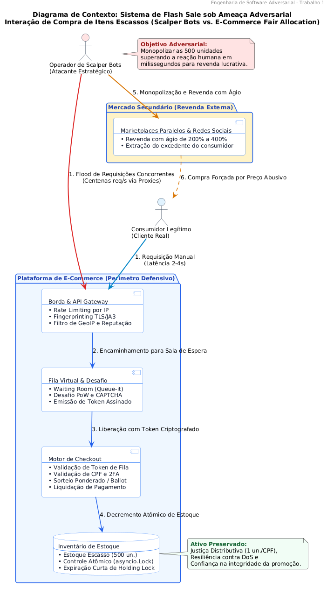
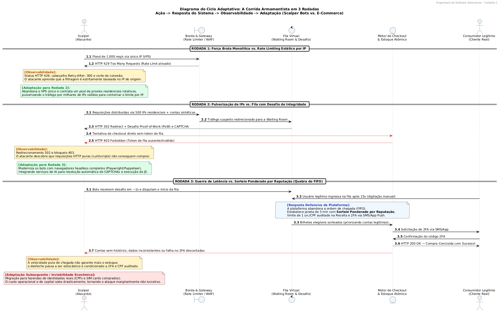
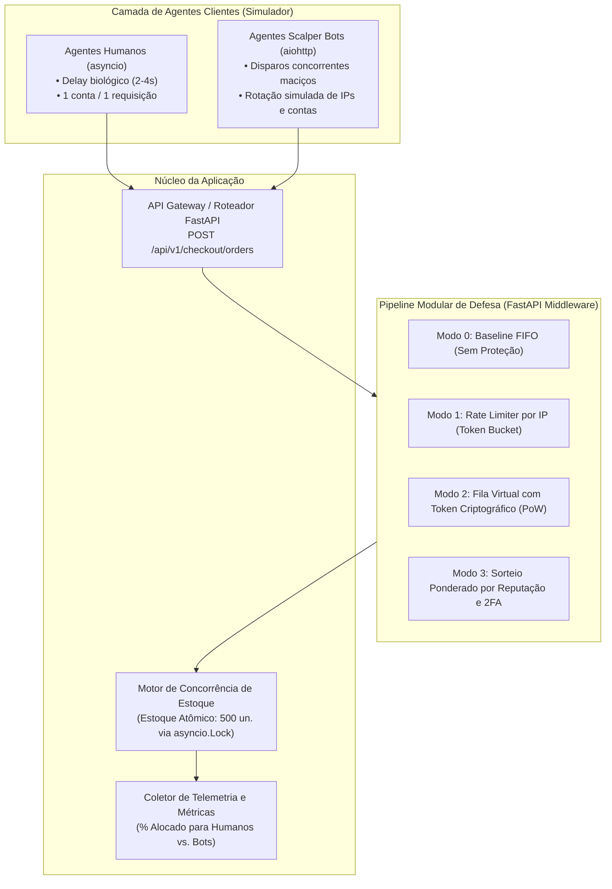

# Análise de um Sistema Adversarial
### Trabalho 1 — Modelo Estático, Modelo Dinâmico, Ameaças e Riscos

  <b>Engenharia de Software Adversarial</b> 
  <i>Etapa de Planejamento e Desenho Arquitetural para Implementação Funcional no Trabalho 2</i>

---

### 📌 Materiais de Apresentação

| Recurso | Formato / Plataforma | Link de Acesso |
| :--- | :---: | :--- |
| 📄 **Slides da Apresentação** | PDF (Google Drive) | *[Inserir link do Google Drive aqui]* |
| 🎥 **Vídeo de Apresentação** | YouTube (Gravação de Vídeo com Slides) | *[Inserir link do YouTube aqui]* |
| 📜 **Roteiro dos Slides e Falas** | Markdown | [fontes/roteiro_apresentacao_slides.md](fontes/roteiro_apresentacao_slides.md) |
| 📑 **Rascunho Base para Integrantes** | Markdown | [fontes/rascunho_completo_para_integrantes.md](fontes/rascunho_completo_para_integrantes.md) |

---

### 👥 Integrantes do Grupo e Divisão de Seções

| 👤 Nome Completo | Matrícula / Função Principal | Seções Atribuídas |
| :--- | :--- | :--- |
| **Rodrigo Thoma da Silva** | Proposta, Escolha do Sistema e Descrição Geral | **Seções 1, 2 e 3.1** |
| **Fade Hassan Husein Kanaan** | Modelo Estático (Teoria dos Jogos 2x2) e Arquitetura para o T2 | **Seções 3.2 e 4** |
| **Artur Wahlbrink Kraemer** | Modelo Dinâmico (Ciclo de 3 Rodadas) e Pergunta Final | **Seções 3.3 e 8** |
| **Gabriel Camargo Ortiz** | Superfície de Ataque, Cenários de Risco, IA e Referências | **Seções 3.4, 5, 6 e 7** |

---

## 1. Proposta

> **Questão central:** *O que torna esse sistema adversarial, como os participantes tomam decisões e como a interação evolui ao longo das rodadas?*

Este trabalho analisa a disputa em torno do checkout concorrente em promoções relâmpago (*Flash Sales*) de Black Friday, onde um lote limitado de 500 unidades de um produto de alta demanda é disponibilizado com grande desconto.

### Por que o sistema é adversarial?

Existe um conflito direto de incentivos entre quem compra e quem vende:

* **Operadores de Scalper Bots (Cambistas Digitais):** Querem monopolizar o estoque no instante exato da abertura das vendas usando automação. O objetivo é revender esses produtos no mercado paralelo com lucro alto (ágio de 200% a 400%), aproveitando que scripts automatizados conseguem enviar pedidos em milissegundos, superando com facilidade a velocidade humana.
* **A Plataforma de E-Commerce (Defensora):** Quer garantir justiça distributiva (1 unidade por CPF), entregando os produtos a 500 compradores reais diferentes. Essa distribuição é essencial para atrair novos clientes, fortalecer a marca e evitar acusações de propaganda enganosa ou fraude no evento.

Essa disputa não decorre de falhas ou instabilidades acidentais: o cambista gasta dinheiro com servidores, proxies e ferramentas automatizadas com a intenção explícita de furar as regras e esgotar o estoque antes dos clientes legítimos.

### Como os participantes tomam decisões?

Os dois lados agem de forma calculada, avaliando custos e ganhos:

* **O cambista (atacante):** Avalia quanto vai gastar em infraestrutura (proxies residenciais, serviços que quebram CAPTCHA e contas falsas) contra o lucro líquido que terá revendendo os produtos. Se o custo de burlar o sistema for menor que o lucro esperado, o ataque compensa.
* **A plataforma (defensora):** Decide quais barreiras de proteção ativar (*Rate Limiting*, filas virtuais, desafios criptográficos e sorteios). O desafio aqui é barrar os bots sem deixar a compra lenta ou frustrante para os clientes de verdade, evitando falsos positivos.

### Como a interação evolui ao longo das rodadas?

A disputa evolui em um ciclo contínuo de ataque, defesa e adaptação:

1. **Ataque em massa:** O cambista dispara milhares de requisições por segundo a partir de servidores em nuvem para comprar tudo no primeiro instante.
2. **Defesa inicial:** A plataforma detecta o pico repentino de tráfego e bloqueia os IPs dos servidores com erro `HTTP 429 (Too Many Requests)`.
3. **Adaptação do atacante:** O cambista percebe o bloqueio por IP e espalha suas requisições por milhares de proxies residenciais, fazendo cada requisição parecer vir de uma conexão doméstica diferente.
4. **Escalação da defesa:** Como filtrar IP já não funciona, a plataforma adota salas de espera virtuais, desafios de integridade e sorteios de vagas. Isso força o cambista a gastar cada vez mais com navegadores completos e contas laranjas, até que a fraude deixe de ser lucrativa.

> **Continuidade com o Trabalho 2:** Esta análise serve como especificação direta para a implementação prática no Trabalho 2, onde construiremos uma API de checkout, um pipeline de defesas comutáveis e uma simulação com clientes reais competindo contra robôs.

---

## 2. Escolha do Sistema

### Ficha Técnica da Interação

| Atributo | Definição no Projeto |
| :--- | :--- |
| **Sistema Escolhido** | Plataforma de E-Commerce com mecânica de *Flash Sale* (promoção relâmpago de estoque escasso). |
| **Interação Específica** | Envio e validação da requisição de compra (`POST /api/v1/checkout/orders`) para adquirir um produto promocional limitado a 500 unidades no exato momento da abertura das vendas. |
| **Contexto de Operação** | Evento de pico promocional (Black Friday) com estoque finito, abertura simultânea para todos os clientes e grande incentivo para revenda no mercado paralelo. |

### Conformidade com os Critérios Obrigatórios do Enunciado

| # | Critério Obrigatório | Atendimento no Sistema Analisado |
| :-: | :--- | :--- |
| **1** | **Pelo menos dois participantes capazes de tomar decisões** | • **Operador de Scalper Bots:** Decide a taxa de disparos, a rede de proxies utilizada, o tipo de automação (requisições diretas via script vs. navegadores *headless*) e o uso de contas laranjas. • **Mecanismo de Checkout e Fila da Plataforma:** Decide como processar as requisições recebidas, se retém usuários em fila virtual, se exige desafios de segurança (CAPTCHA/PoW) e se distribui o estoque por ordem de chegada ou sorteio. |
| **2** | **Objetivos total ou parcialmente conflitantes** | • **Scalper:** Quer concentrar e monopolizar o maior número de unidades para revender com ágio. • **Plataforma:** Quer pulverizar o estoque (limite de 1 item por CPF) entre clientes reais para gerar fidelização e evitar danos à reputação da marca. |
| **3** | **Regra, métrica ou decisão explorável** | A regra clássica de **ordem de chegada por velocidade de rede (FIFO estrito)**. O atacante se aproveita dessa regra disparando scripts automatizados de dentro de servidores em nuvem, completando a compra em poucos milissegundos — algo humanamente impossível para quem usa navegadores comuns. |
| **4** | **Resposta observável que permita reação ou adaptação** | O atacante observa as respostas imediatas da API: códigos de erro HTTP (200, 403, 429, 503), cabeçalhos de limitação (`Retry-After`), latência da conexão, redirecionamentos para telas de fila e a contagem pública de estoque restante. Com esses dados, ele recalibra sua estratégia de ataque. |
| **5** | **Escopo viável para implementação no Trabalho 2** | O escopo é conciso e modular: um endpoint de checkout (`/checkout`), controle de concorrência de estoque em memória (`asyncio.Lock`), camadas comutáveis de proteção (Rate Limiting, Fila Virtual e Sorteio) e um script de teste simulando clientes humanos competindo contra robôs. |

---

## 3. Desenvolvimento

### 3.1 Descrição do Sistema Adversarial

* **Qual é o sistema e qual interação será analisada:**  
  Plataforma de E-Commerce durante uma promoção relâmpago (*Flash Sale*). A interação analisada é a **submissão e o processamento da ordem de compra** no endpoint `POST /api/v1/checkout/orders`, onde centenas de clientes e robôs disputam 500 unidades promocionais de um produto escasso.

* **Quais são os principais atores:**  
  * **Operador de Scalper Bots (Atacante):** Comprador automatizado que utiliza scripts e robôs para monopolizar o estoque com o objetivo de revendê-lo com lucro no mercado paralelo.
  * **Mecanismo de Fila e Defesa da Plataforma (Defensor):** Conjunto de serviços e regras de negócio responsáveis por proteger a infraestrutura de quedas e garantir que o estoque seja distribuído de forma justa.
  * *(Ator de contexto) Consumidor Legítimo:* Cliente humano real que tenta comprar o produto manualmente pela interface web ou aplicativo para uso próprio.

* **Qual ativo ou propriedade precisa ser preservado:**  
  * **Justiça Distributiva (*Fair Allocation*):** Garantir que as 500 unidades sejam distribuídas entre 500 pessoas físicas distintas, evitando que um único operador capture grande parte do estoque.
  * **Disponibilidade da Infraestrutura:** Manter a API de checkout e os servidores estáveis durante o pico de requisições, sem sofrer lentidão generalizada ou quedas de serviço (DDoS acidental/intencional).
  * **Confiança na Marca:** Manter a credibilidade da promoção diante do público, evitando a sensação de que o evento foi uma farsa ou que "o site travou de propósito".

* **Quais ações ou capacidades cada ator possui:**  
  * **Operador de Scalper Bots:** Disparar centenas de requisições por segundo em paralelo; alternar endereços IP usando proxies residenciais; rodar navegadores automatizados (*headless* como Playwright); terceirizar a quebra de CAPTCHAs via APIs de IA; cadastrar contas em massa com dados fictícios ou CPFs vazados.
  * **Plataforma (Defensora):** Inspecionar cabeçalhos HTTP e assinaturas de conexão (TLS/JA3); aplicar limites de taxa (*Rate Limiting*); reter usuários em salas de espera virtuais (*Waiting Rooms*); exigir desafios computacionais (Proof-of-Work) e CAPTCHA; validar dados cadastrais (CPF); cancelar pedidos suspeitos e trocar a regra de entrega de FIFO para sorteio randômico ponderado.

* **Quais informações cada ator consegue observar:**  
  * **O Scalper observa:** Códigos de retorno HTTP (200, 403, 429, 503); tempo de resposta da API; cabeçalhos como `Retry-After`; se foi redirecionado para telas de fila; mensagens de erro do backend; e se o contador público de estoque diminuiu ou zerou.
  * **A Plataforma observa:** Endereço IP de origem, ASN e localização geográfica; volume de requisições por segundo por IP e por sessão; características do navegador (*fingerprint* de Canvas/WebGL); tempo de interação na tela (tempo para preencher campos e cliques); histórico da conta e dados do cartão de crédito.

* **Quais custos ou restrições limitam suas ações:**  
  * **Restrições do Scalper:** Custo financeiro para pagar proxies residenciais (cobrados por GB) e serviços de quebra de CAPTCHA; custo de obter contas e cartões válidos; risco de ter pedidos cancelados com dinheiro temporariamente retido na operadora do cartão.
  * **Restrições da Plataforma:** Custo de servidores e serviços externos de proteção (como Cloudflare ou Queue-it); risco de **falsos positivos** (bloquear por engano clientes humanos legítimos); risco de **atrito excessivo** (tornar o processo tão burocrático e lento que clientes reais desistem da compra).

* **Pelo menos dois pressupostos dos quais o sistema depende:**  
  1. *Pressuposto da Identidade Única:* O sistema assume que cada requisição autenticada com um CPF representa um ser humano real e independente querendo comprar para si.
  2. *Pressuposto da Latência Justa:* O sistema assume que atender as requisições por ordem de chegada no servidor (FIFO) é um critério justo e equivalente ao esforço de "chegar primeiro".

* **Como esses pressupostos podem falhar:**  
  1. *Falha da Identidade Única (Ataque Sybil):* Um único cambista pode usar geradores de CPF ou dados comprados para criar dezenas de contas falsas, operando simultaneamente como se fossem vários clientes distintos.
  2. *Falha da Latência Justa (Vantagem dos Robôs):* Servidores em nuvem executando scripts conseguem fechar conexões e enviar pedidos em menos de 50 milissegundos. Um humano na tela leva entre 2 a 4 segundos apenas para ler e clicar no botão, tornando impossível vencer robôs numa disputa puramente baseada em velocidade de rede.

#### Tabela de Atores

| Ator | Objetivo | Ações ou capacidades | Informações observáveis | Restrições ou custos |
|---|---|---|---|---|
| **Operador de Scalper Bots (Atacante)** | Monopolizar as 500 unidades para revenda com lucro no mercado paralelo. | Disparar requisições em massa, rotacionar proxies, rodar navegadores *headless*, quebrar CAPTCHA e operar múltiplas contas. | Códigos de status HTTP, tempo de resposta da API, telas de fila e contagem de estoque. | Custos com proxies e solvers de CAPTCHA, custo de contas/cartões e risco de cancelamento com retenção de saldo. |
| **Mecanismo de Fila e Defesa (Defensor)** | Garantir distribuição justa (1 item/CPF), manter a infraestrutura estável e proteger a reputação da plataforma. | Aplicar Rate Limiting, colocar em fila virtual, exigir desafios (PoW/CAPTCHA), validar cadastros e adotar sorteio. | Tráfego por segundo, dados de rede/IP, *fingerprints* de navegadores, telemetria de tela e histórico de compras. | Custos de infraestrutura de nuvem, risco de atrito excessivo com usuários e risco de falsos positivos (barrar clientes reais). |

#### Diagrama de Contexto

#### Natureza Adversarial do Caso
Este cenário é estritamente adversarial porque existe um participante racional e intencional agindo contra as regras de negócio da plataforma para obter lucro financeiro. O cambista não está apenas gerando tráfego alto por acidente ou explorando um bug; ele estuda como a API funciona, mede as respostas da rede e adapta suas ferramentas de propósito para driblar as proteções. Quando a plataforma ergue uma barreira (como bloqueio de IP), o atacante não desiste: ele muda sua estratégia (usando proxies e contas falsas), gerando uma corrida contínua de ataque e defesa.

---

### 3.2 Modelo Estratégico Estático

Para modelar a decisão central no instante de abertura da promoção relâmpago, definimos um jogo simultâneo em forma normal com dois jogadores e duas ações disponíveis para cada um:
* **Jogador A (Scalper):**
  * $A_1$ — **Flood de Bots Concorrentes:** Dispara automação em alta velocidade para capturar o maior número possível de unidades no instante de abertura.
  * $A_2$ — **Compra Manual / Humana:** Respeita a interface gráfica oficial e a cadência de interação humana comum.
* **Jogador B (Plataforma de E-Commerce):**
  * $B_1$ — **Checkout Direto FIFO (Sem Fricção):** Arquitetura tradicional orientada à máxima conversão e mínima latência, sem validações comportamentais pesadas ou filas de espera.
  * $B_2$ — **Fila Virtual Justa com Desafio de Integridade:** Mecanismo com sala de espera, análise de risco, desafio criptográfico e reserva controlada.

#### Matriz de Decisão (Jogo 2x2)

> **Ordem dos payoffs no par:** `(Payoff do Jogador A - Scalper, Payoff do Jogador B - Plataforma)`  
> **Escala ordinal de preferência:** `3` = Melhor resultado; `2` = Bom resultado; `1` = Resultado desfavorável; `0` = Pior resultado.

| Jogador A (Scalper) \ Jogador B (Plataforma) | $B_1$: Checkout Direto FIFO (Sem Fricção) | $B_2$: Fila Justa com Desafio de Integridade |
| :--- | :---: | :---: |
| **$A_1$: Flood de Bots Concorrentes** | $(3, 0)$ | $(\mathbf{1}, \mathbf{2})$ |
| **$A_2$: Compra Manual / Humana** | $(2, 3)$ | $(0, 1)$ |

#### Análise do Modelo Estático

* **O que representa cada ação:**
  * **$A_1$ (Flood de Bots):** Utilização de scripts automatizados de alta concorrência para submeter ordens de compra em milissegundos.
  * **$A_2$ (Compra Manual):** Submissão convencional via navegador ou app móvel, sujeita a tempos de reação e digitação humanos.
  * **$B_1$ (Checkout Direto FIFO):** Processamento imediato por ordem de chegada de pacotes de rede, priorizando velocidade de checkout e simplicidade arquitetural.
  * **$B_2$ (Fila Justa com Desafio):** Interposição de sala de espera virtual (*Waiting Room*), verificação de integridade e ordenação equitativa, reduzindo o impacto da velocidade pura.

* **Por que cada resultado recebeu aqueles payoffs:**
  * **$(A_1, B_1) \rightarrow (3, 0)$:** 
    * *Scalper (3):* Conquista o melhor resultado possível. Os bots arrematam 100% do estoque promocional em milissegundos com custo operacional mínimo de evasão, garantindo lucro máximo de revenda no mercado secundário.
    * *Plataforma (0):* Sofre o pior desfecho. O estoque é liquidado para especuladores, clientes reais ficam frustrados e acusam o evento de propaganda enganosa nas redes sociais, e a infraestrutura enfrenta sobrecarga severa de requisições.
  * **$(A_1, B_2) \rightarrow (1, 2)$:** 
    * *Scalper (1):* A maioria dos bots fica retida na fila virtual ou é barrada pelos desafios; para manter chances de sucesso, o atacante precisa gastar recursos financeiros com proxies caros e solvers de CAPTCHA, obtendo apenas uma fração do estoque.
    * *Plataforma (2):* Bloqueia o ataque massivo e distribui a maior parte das unidades a consumidores legítimos, preservando sua reputação, embora arque com custos de infraestrutura e aumente a latência percebida do checkout.
  * **$(A_2, B_1) \rightarrow (2, 3)$:** 
    * *Scalper (2):* O operador tenta comprar como um consumidor comum e possui chance razoável e honesta de obter o produto pelo preço promocional com esforço mínimo.
    * *Plataforma (3):* Cenário idílico de máxima utilidade. Custo computacional reduzido (sem servidores de fila ou WAF complexo), taxa de conversão altíssima e compradores autênticos satisfeitos.
  * **$(A_2, B_2) \rightarrow (0, 1)$:** 
    * *Scalper (0):* O comprador manual sofre com longas salas de espera, atrito de desafios e alta concorrência, tendo baixa chance de sucesso.
    * *Plataforma (1):* Mantém uma infraestrutura de segurança cara e pesada que gera atrito desnecessário para uma base de clientes que nem sequer estava utilizando ferramentas automatizadas.

* **Quais são as melhores respostas dos jogadores:**
  * **Melhores respostas do Jogador A (Scalper):**
    * Se a Plataforma escolhe $B_1$ (Checkout Direto), o Scalper compara $A_1$ (payoff 3) com $A_2$ (payoff 2). A melhor resposta é **$A_1$** ($3 > 2$).
    * Se a Plataforma escolhe $B_2$ (Fila Justa), o Scalper compara $A_1$ (payoff 1) com $A_2$ (payoff 0). A melhor resposta é **$A_1$** ($1 > 0$).
  * **Melhores respostas do Jogador B (Plataforma):**
    * Se o Scalper escolhe $A_1$ (Flood de Bots), a Plataforma compara $B_1$ (payoff 0) com $B_2$ (payoff 2). A melhor resposta é **$B_2$** ($2 > 0$).
    * Se o Scalper escolhe $A_2$ (Compra Manual), a Plataforma compara $B_1$ (payoff 3) com $B_2$ (payoff 1). A melhor resposta é **$B_1$** ($3 > 1$).

* **Existe estratégia dominante?**
  **Sim.** Para o Jogador A (Scalper), a ação **$A_1$ (Flood de Bots Concorrentes)** é uma **estratégia estritamente dominante**. Independentemente de a plataforma adotar checkout direto sem defesas ($B_1$) ou uma fila com desafios de segurança ($B_2$), o atacante obtém um payoff estritamente maior utilizando automação do que submetendo manualmente ($3 > 2$ e $1 > 0$). O scalper racional sempre escolherá automatizar.

* **Existe um resultado no qual nenhum jogador melhora mudando sozinho (Equilíbrio de Nash)?**
  **Sim.** O par de estratégias **$(A_1, B_2)$**, correspondente ao desfecho com payoffs **$(1, 2)$**, é o **único Equilíbrio de Nash em estratégias puras** deste jogo.  
  * *Verificação de estabilidade:* Dado que o Scalper joga $A_1$, a Plataforma não tem incentivo para desviar unilateralmente para $B_1$ (seu payoff cairia de 2 para 0). Dado que a Plataforma joga $B_2$, o Scalper não tem incentivo para desviar unilateralmente para $A_2$ (seu payoff cairia de 1 para 0). Nenhum jogador melhora sua recompensa mudando de estratégia isoladamente.

* **Esse resultado é bom para o sistema e para os usuários legítimos?**
  **Não. Trata-se de um equilíbrio ineficiente segundo o critério de Pareto**, análogo à armadilha do *Dilema do Prisioneiro*:
  * O ótimo social cooperativo ocorreria em $(A_2, B_1)$, onde a soma total de utilidade dos participantes seria $5$ ($2 + 3$). Nesse ponto idílico, todos compram manualmente sem custos de defesa ou ataques.
  * No entanto, como a tentação de trapacear é estritamente dominante para o scalper, o sistema é arrastado para o equilíbrio estável de segurança em $(A_1, B_2)$, onde a soma de payoffs cai para $3$ ($1 + 2$).
  * Para a plataforma, isso impõe custos perenes de infraestrutura de mitigação e licenciamento de softwares anti-bot. Para os **usuários legítimos**, esse equilíbrio acarreta efeitos colaterais indesejados: salas de espera obrigatórias, maior tempo de checkout, necessidade de resolução de CAPTCHAs invasivos e a frustração de perder compras mesmo cumprindo todas as regras de boa-fé.

---

### 3.3 Modelo Estratégico Dinâmico

Enquanto o modelo estático analisa a decisão em um instante isolado, o modelo dinâmico retrata a disputa ao longo do tempo como um jogo repetido em três rodadas consecutivas:

$$\text{Ação do Atacante} \longrightarrow \text{Resposta do Sistema} \longrightarrow \text{Observação} \longrightarrow \text{Adaptação}$$

#### Ciclo de Rodadas Adversariais

| Rodada | Ação do participante (Scalper) | Resposta do sistema (Plataforma) | O que se torna observável? | Adaptação para a rodada seguinte |
| :---: | :--- | :--- | :--- | :--- |
| **1** | **Ataque em massa por servidor único:** Dispara centenas de requisições por segundo contra a rota `/checkout` a partir de uma máquina virtual em nuvem (VPS) com alta velocidade de rede. | **Bloqueio simples por IP (Rate Limiting):** A API identifica o volume fora do normal vindo de um único IP e corta o acesso temporariamente com erro `HTTP 429 Too Many Requests`. | O código de erro `HTTP 429`, o cabeçalho `Retry-After: 300` e a conexão interrompida. O cambista percebe de imediato que a defesa analisa apenas o IP de origem. | **Distribuição de IPs:** O cambista contrata redes de proxies residenciais rotativos, espalhando as requisições por milhares de conexões domésticas diferentes. |
| **2** | **Ataque distribuído por múltiplos IPs:** Dispara pedidos usando centenas de IPs residenciais ao mesmo tempo para furar o *Rate Limiter*, usando dados cadastrais fictícios. | **Fila virtual com desafio de integridade:** A plataforma redireciona o tráfego para uma sala de espera que exige resolver um teste computacional rápido (PoW) e um CAPTCHA antes de liberar um token de compra (`ticket_token`). | O redirecionamento `HTTP 302` para a tela de fila e respostas `HTTP 403 Forbidden` para chamadas diretas de API sem o token assinado. O cambista vê que scripts simples de terminal já não conseguem comprar. | **Navegadores automatizados e solvers de IA:** O cambista substitui scripts HTTP simples por navegadores reais automatizados (*headless* Playwright/Puppeteer) integrados a serviços de IA que resolvem CAPTCHA automaticamente. |
| **3** | **Bypass automatizado dos desafios:** Robôs rodam navegadores completos, resolvem os desafios em menos de um segundo e enviam as ordens de compra assim que a fila libera. | **Fim da ordem de chegada (Sorteio + 2FA):** A plataforma abandona o critério de quem chega primeiro (FIFO). Abre uma janela de 3 minutos para entrada, sorteia as vagas ponderando o histórico da conta e exige código de verificação via SMS/WhatsApp (2FA) e CPF válido. | A ordem de chegada perde valor prático; o resultado passa a depender de sorteio e a plataforma passa a exigir o código numérico enviado para um celular real. | **Contas de terceiros e rede humana:** O cambista precisa alugar dados de pessoas reais e números de celular físicos (chips reais) para tentar aprovar as compras sorteadas. Os custos sobem a ponto de a operação se tornar inviável, forçando o cambista a desistir ou focar em sites concorrentes desprotegidos. |

#### Diagrama do Ciclo Adaptativo

#### Perguntas de Análise Dinâmica

* **Quem observa quem?**  
  O **cambista observa a resposta externa da plataforma**: códigos de erro HTTP, cabeçalhos de rede, tempo de resposta das chamadas, redirecionamentos para telas de fila e se o estoque público está diminuindo.  
  A **plataforma observa o comportamento dos clientes**: volume e concentração de conexões por segundo, assinaturas de navegador e rede, velocidade de preenchimento de campos e compras finalizadas em frações de segundo incompatíveis com a reação de um ser humano.

* **O que cada lado consegue mudar?**  
  O **cambista consegue mudar:** a infraestrutura de rede (trocando IPs e provedores de proxy), o tipo de ferramenta (passando de scripts simples para navegadores completos automatizados), o ritmo de envio e os dados cadastrais utilizados.  
  A **plataforma consegue mudar:** os limites de conexões por segundo, o fluxo da compra (colocando salas de espera e tokens temporários), as barreiras de humanidade (CAPTCHA e desafios de máquina), a exigência de confirmação no celular (2FA) e a própria regra de entrega do produto (trocando ordem de chegada por sorteio).

* **O que dispara uma adaptação?**  
  Para o **cambista:** a perda de eficiência do ataque — quando os robôs recebem erros de bloqueio (403, 429) ou quando o estoque acaba para clientes comuns antes de seus scripts conseguirem fechar os pedidos.  
  Para a **plataforma:** o sinal de que o objetivo de negócio foi quebrado — 500 unidades esgotadas em 2 segundos, servidores caindo pelo volume excessivo ou reclamações em massa de clientes nas redes sociais dizendo que a promoção foi enganosa.

* **Qual é o custo da adaptação para cada lado?**  
  Para o **cambista:** gastos financeiros com planos de proxies residenciais, assinaturas de ferramentas que quebram CAPTCHA, compra de dados de terceiros e o trabalho técnico de atualizar os scripts a cada mudança do site.  
  Para a **plataforma:** custos com servidores e serviços de segurança na nuvem, esforço de engenharia para criar regras de fila e, principalmente, **o incômodo gerado para o cliente honesto**, que precisa enfrentar salas de espera, resolver quebra-cabeças visuais e esperar mensagens de SMS no celular.

* **Em que ponto pode surgir uma corrida armamentista?**  
  A corrida armamentista começa quando a defesa deixa de olhar apenas para dados simples de rede (como IP) e passa a analisar **como o cliente se comporta e interage na página**. A partir desse momento, o atacante é obrigado a criar robôs que imitam a navegação humana com perfeição (movendo o mouse com curvas naturais, variando o tempo entre cliques e simulando navegadores reais). Essa disputa atinge o limite quando a plataforma para de tentar adivinhar se a requisição é de um robô na velocidade da rede e transfere o controle para **barreiras de identidade física (sorteios com 2FA e CPF auditado)**, transformando uma briga técnica de servidores em um filtro de custo financeiro real.

---

### 3.4 Ameaças e Riscos

A superfície de ataque do sistema está concentrada nos pontos em que o
participante adversarial consegue interagir diretamente com os mecanismos de
compra, identificação e reserva de estoque.

O diagrama de superfície de ataque está disponível em:

- `diagramas/superficie-de-ataque.png`
- `diagramas/superficie-de-ataque.puml`

#### 3.4.1 Pontos de Exploração

Foram identificados três pontos principais de exploração.

##### P1 — Endpoint de Checkout

O endpoint `POST /api/v1/checkout/orders` representa o ponto principal de
disputa pelo estoque promocional.

Em um modelo baseado principalmente na ordem de chegada das requisições, um
operador de scalper bots pode utilizar automação e alta concorrência para
submeter pedidos em uma velocidade muito superior à de consumidores humanos.

A principal fraqueza explorada é considerar a velocidade de chegada como um
critério suficiente para definir quem terá acesso ao estoque.

##### P2 — Serviço de Contas

O endpoint `POST /api/v1/auth/register` pode ser explorado por um participante
que tente criar múltiplas identidades para contornar regras como o limite de
uma unidade por pessoa.

Caso o sistema trate cada conta como uma pessoa distinta sem mecanismos
adicionais de validação, o pressuposto de identidade única deixa de ser válido.

Esse comportamento caracteriza uma estratégia do tipo Sybil, na qual várias
identidades são controladas pelo mesmo participante.

##### P3 — Reserva de Carrinho

O endpoint `PUT /api/v1/cart/reserve` permite reservar temporariamente uma
unidade durante o processo de compra.

Caso o tempo de reserva seja excessivo ou não exista um custo relevante para
criar uma reserva, bots podem manter várias unidades indisponíveis sem concluir
o pagamento.

Essa exploração pode reduzir artificialmente o estoque disponível para
consumidores legítimos, mesmo quando nenhuma venda é efetivamente concluída.

---

#### 3.4.2 Cenários de Ameaça

A partir dos pontos de exploração identificados, foram definidos três cenários
de ameaça seguindo o formato estabelecido no enunciado.

##### A1 — Flood Automatizado no Checkout

Um **operador de scalper bots** pode realizar **um grande número de tentativas
concorrentes de compra** por meio do **endpoint de checkout**, aproveitando
**a política FIFO e a vantagem de velocidade da automação em relação aos
usuários humanos**, causando **monopolização do estoque e possível sobrecarga do serviço**
sobre a **justiça distributiva**, além de afetar a disponibilidade da API.

##### A2 — Criação de Múltiplas Identidades

Um **operador de scalper bots** pode realizar **a criação e utilização de
múltiplas contas** por meio do **serviço de contas**, aproveitando
**o pressuposto de que cada conta corresponde a uma pessoa distinta**,
causando **evasão do limite de uma unidade por pessoa** sobre a
**justiça distributiva do estoque promocional**.

##### A3 — Retenção Artificial de Estoque

Um **operador de scalper bots** pode realizar **reservas repetidas sem
finalização da compra** por meio do **mecanismo de reserva temporária de
estoque**, aproveitando **um tempo de retenção elevado e a ausência de custo
para abandonar reservas**, causando **indisponibilidade temporária de unidades
e frustração dos consumidores**, com impacto sobre a **confiança do cliente**.

---

#### 3.4.3 Avaliação dos Riscos

Os cenários de ameaça foram avaliados utilizando a escala definida no enunciado:

- **Probabilidade:** 1 = baixa, 2 = média, 3 = alta;
- **Impacto:** 1 = baixo, 2 = médio, 3 = alto;
- **Risco:** probabilidade × impacto.

| ID | Cenário de ameaça | Ponto de exploração | Pressuposto ou fraqueza | Ativo afetado | Probabilidade | Impacto | Risco |
|---|---|---|---|---|---:|---:|---:|
| A1 | Flood automatizado de requisições de compra | Endpoint de Checkout | Política FIFO e vantagem de velocidade da automação | Justiça distributiva | 3 | 3 | **9** |
| A2 | Criação de múltiplas identidades | Serviço de Contas | Pressuposto de que cada conta representa uma pessoa distinta | Justiça distributiva | 3 | 2 | **6** |
| A3 | Retenção artificial de unidades | Reserva de Carrinho | Tempo de retenção elevado e ausência de custo para abandonar reservas | Confiança do cliente | 2 | 2 | **4** |

A ameaça **A1 — Flood Automatizado no Checkout** foi classificada como a
ameaça de maior prioridade, com risco **9**.

Sua probabilidade é considerada alta porque a automação de requisições é uma
estratégia diretamente compatível com o objetivo do operador de scalper bots e
pode ser executada em grande escala.

O impacto também é alto porque a exploração pode afetar simultaneamente a
distribuição justa das unidades promocionais e a disponibilidade do serviço,
prejudicando consumidores legítimos e a própria operação da plataforma.

---

#### 3.4.4 Resposta à Ameaça Prioritária

A ameaça **A1 — Flood Automatizado no Checkout** foi selecionada para análise
detalhada por apresentar o maior nível de risco identificado.

##### Resposta do Sistema

A plataforma pode responder substituindo o processamento baseado exclusivamente
em FIFO por mecanismos que reduzam a vantagem obtida pela velocidade das
requisições.

Entre as possíveis medidas estão o uso de rate limiting, fila virtual com
tokens assinados, desafios de integridade e mecanismos de ordenação que não
dependam somente do instante de chegada da requisição.

Esses controles aumentam o custo da automação em larga escala e reduzem a
capacidade de um único participante monopolizar o estoque.

##### Informação Revelada pela Resposta

A defesa adotada também produz informações observáveis pelo adversário.

Respostas como `HTTP 429 Too Many Requests`, aumento do tempo de espera,
inclusão de desafios adicionais ou mudanças no comportamento da fila permitem
ao operador perceber quais padrões de acesso estão sendo limitados.

Dessa forma, a resposta do sistema não apenas bloqueia determinadas ações,
mas também fornece sinais sobre a estratégia de defesa utilizada.

##### Adaptação do Adversário

Após perceber que requisições concentradas estão sendo limitadas, o operador
pode adaptar sua estratégia utilizando diferentes endereços de origem, reduzindo
a frequência de cada agente ou distribuindo as tentativas entre várias
identidades.

Caso a plataforma utilize filas virtuais e desafios de integridade, o adversário
também pode tentar aproximar o comportamento dos bots ao comportamento de
usuários legítimos.

O objetivo do atacante permanece o mesmo, mas as ações utilizadas para alcançá-lo
mudam conforme as respostas observadas.

##### Efeitos Colaterais sobre Usuários Legítimos

Os mecanismos de defesa também podem aumentar o custo de interação para
consumidores legítimos.

Entre os possíveis efeitos colaterais estão:

- aumento da latência durante o checkout;
- necessidade de aguardar em uma fila virtual;
- exigência de desafios adicionais;
- possibilidade de falsos positivos;
- maior tempo para concluir a compra;
- frustração de consumidores legítimos durante períodos de alta demanda.

Assim, uma defesa mais restritiva pode melhorar a resistência contra bots, mas
também prejudicar a experiência de usuários que seguem as regras do sistema.

##### Risco Residual

Mesmo após a adoção dos mecanismos de defesa, o risco não é completamente
eliminado.

O adversário pode distribuir suas requisições entre múltiplos endereços,
utilizar diferentes contas ou alterar a frequência das ações para reduzir a
probabilidade de detecção.

Além disso, quanto mais o comportamento automatizado se aproxima do comportamento
de um usuário legítimo, maior se torna a dificuldade de distinguir os dois sem
aumentar também a ocorrência de falsos positivos.

Portanto, a resposta defensiva reduz a vantagem inicial dos scalper bots, mas
mantém um risco residual decorrente da capacidade de adaptação do participante
adversarial.

##### Propriedades que Devem Continuar Preservadas

Mesmo com a evolução das estratégias de ataque e defesa, a plataforma deve
continuar preservando três propriedades principais:

1. **Justiça distributiva:** evitar que poucos participantes obtenham uma parcela
   desproporcional do estoque utilizando vantagens técnicas.
2. **Disponibilidade:** manter o serviço acessível durante períodos de grande
   volume de requisições.
3. **Confiança:** evitar que os mecanismos de proteção tornem o processo de
   compra excessivamente oneroso para consumidores legítimos.

A defesa deve, portanto, aumentar o custo da estratégia adversarial sem tornar
o processo de compra inviável para os participantes legítimos.

---

## 4. Continuidade com o Trabalho 2: Planejamento Arquitetural

Este Trabalho 1 funciona como a especificação de requisitos e desenho conceitual para a **implementação funcional que será desenvolvida no Trabalho 2**.

### Decisões Arquiteturais Concretas para a Implementação no Trabalho 2:
1. **Linguagem e Stack Tecnológica:**
   * Backend em **Python 3.11+ utilizando FastAPI e Uvicorn**, aproveitando o ecossistema assíncrono nativo (`asyncio`) para gerenciar centenas de conexões simultâneas com baixo consumo de memória.
2. **Componente de Controle de Concorrência de Estoque (`InventoryEngine`):**
   * O estoque promocional (500 unidades) será gerenciado em memória através de operações atômicas protegidas por um primitivo `asyncio.Lock` (ou estrutura simulada em Redis), prevenindo condições de corrida (*race conditions* e *overselling*).
3. **Pipeline Modular de Defesas Comutáveis (`DefensePipeline`):**
   * A aplicação contará com um mecanismo de alternância de estratégias de mitigação via variáveis de ambiente ou flags de configuração, permitindo demonstrar empiricamente a transição entre as rodadas:
     * `DEFENSE_MODE=0`: Baseline sem defesas (FIFO estrito — demonstrando a vitória absoluta dos bots na Rodada 1);
     * `DEFENSE_MODE=1`: Rate Limiting estático por IP via algoritmo de *Token Bucket*;
     * `DEFENSE_MODE=2`: Sala de espera com emissão de token assinado (`HMAC`) após desafio computacional;
     * `DEFENSE_MODE=3`: Sorteio ponderado com limite de 1 item por CPF e simulação de 2FA.
4. **Simulador de Atores Adversariais (`simulator.py`):**
   * Um script concorrente construído com `aiohttp` que executará simultaneamente dois grupos de agentes:
     * *Grupo de Usuários Humanos (50 instâncias):* Apresenta atrasos de navegação estocásticos de 2 a 5 segundos e envia dados cadastrais únicos.
     * *Grupo de Scalper Bots (500 instâncias assíncronas):* Dispara requisições com intervalo de milissegundos, simula rotação de IPs e tenta explorar atalhos no fluxo de compra.
5. **Dashboard e Métricas de Eficácia:**
   * A aplicação exibirá ao final de cada execução: o tempo total até o esgotamento do estoque, o número de requisições bloqueadas por cada camada de segurança, a latência média de atendimento e, crucialmente, o **índice de justiça distributiva** (percentual de itens alocados para clientes legítimos vs. monopolizados por bots).

---

## 5. Referências e Fontes Consultadas

Todas as fontes teóricas, padrões de segurança em software e estudos de caso da indústria que embasam este relatório estão detalhados em [fontes/referencias.md](fontes/referencias.md).

### Principais Obras e Normas:
1. **QUINCOZES, Silvio Ereno.** *Aulas, Notas de Estudo e Videoaulas da Disciplina de Engenharia de Software Seguro e Engenharia de Software Adversarial*. Universidade Federal do Pampa (UNIPAMPA), Campus Alegrete. Programa de Pós-Graduação em Engenharia de Software (PPGES) e Bacharelado em Engenharia de Software. (Conceituação de sistemas adversariais, paradoxo da suposição cooperativa, dinâmica de rodadas e modelagem de incentivos).
2. **NASH, John.** *Equilibrium Points in N-Person Games*. Proceedings of the National Academy of Sciences, v. 36, n. 1, p. 48-49, 1950. (Fundamentação do Equilíbrio de Nash).
3. **GIBBONS, Robert.** *Game Theory for Applied Economists*. Princeton University Press, 1992. (Metodologia de payoffs e análise de estratégias dominantes).
4. **OWASP.** *OWASP Automated Threats to Web Applications*. Padrão OAT-005 (*Scalping*), OAT-009 (*Denial of Inventory*) e OAT-019 (*Account Creation*), 2020.
5. **ANDERSON, Ross.** *Security Engineering: A Guide to Building Dependable Distributed Systems*. 3. ed. Wiley, 2020. (Economia da segurança da informação e incentivos assimétricos).
6. **CLOUDFLARE.** *Stopping Scalpers: Architectural Approaches to Defend Limited Inventory Drops*. Technical Report, 2023.
7. **QUEUE-IT.** *The Anatomy of Fair Queue Systems for High-Demand E-Commerce Drops*. Technical Whitepaper, 2022.

---

## 6. Declaração sobre Uso de IA Generativa

Durante o desenvolvimento deste trabalho, foram utilizadas ferramentas de IA
generativa, incluindo **Claude** e **ChatGPT**, como apoio à produção e revisão
dos artefatos.

### 6.1 Tarefas em que a IA Generativa foi Utilizada

As ferramentas foram utilizadas principalmente nas seguintes atividades:

- auxílio na organização e formatação do conteúdo em Markdown;
- sugestão e refinamento de roteiros para a apresentação;
- apoio na estruturação de textos e descrições técnicas;
- suporte à elaboração e revisão dos scripts utilizados na geração dos diagramas.

### 6.2 Metodologia de Verificação e Validação

O conteúdo produzido com auxílio de IA foi revisado pelo grupo antes de ser
incorporado aos artefatos do trabalho.

A verificação incluiu:

- **Validação dos payoffs:** conferência manual dos valores da matriz de decisão,
  das melhores respostas, da estratégia dominante e do Equilíbrio de Nash;

- **Revisão do modelo dinâmico:** verificação da coerência entre ação, resposta,
  observação e adaptação ao longo das rodadas adversariais;

- **Revisão dos cenários de ameaça:** comparação dos cenários descritos com os
  conceitos utilizados no trabalho e com as referências OWASP OAT adotadas
  pelo grupo;

- **Consistência entre artefatos:** conferência dos diagramas, tabelas de riscos,
  modelos estratégico estático e dinâmico e texto do relatório para evitar
  contradições;

- **Domínio do conteúdo:** revisão das decisões e justificativas pelos integrantes
  do grupo para que todos consigam explicar o conteúdo apresentado no relatório
  e no vídeo.

A IA foi utilizada, portanto, como ferramenta de apoio à escrita, organização e
revisão, permanecendo com os integrantes do grupo a responsabilidade pela
validação técnica e pelas decisões apresentadas no trabalho.

---

## 7. Contribuições Individuais dos Integrantes

Para garantir total conformidade com o **Critério 5 da Rubrica de Avaliação** (balanço de contribuições individuais comprovadas por commits no Git e divisão equitativa de falas na apresentação em vídeo):

| Integrante | Responsabilidades Principais no Projeto | Seções Desenvolvidas no Relatório | Artefatos e Diagramas Responsáveis | Participação na Apresentação em Vídeo |
| :--- | :--- | :--- | :--- | :--- |
| **Rodrigo Thoma da Silva** | Definição da proposta, caracterização do sistema de Flash Sale, ativos críticos e pressupostos. | **Seção 1, Seção 2 e Seção 3.1** | `contexto.png`, `contexto.puml` e `contexto.mmd` | **Bloco 1 (Abertura):** Motivação da Black Friday, delimitação da interação e apresentação do diagrama de contexto (2 a 3 min). |
| **Fade Hassan Husein Kanaan** | Modelagem formal de Teoria dos Jogos (matriz 2x2), análise de dominância e desenho arquitetural para o T2. | **Seção 3.2 e Seção 4** | Matriz de Payoffs e Arquitetura de Componentes do T2 | **Bloco 2 (Modelo Estático & T2):** Explicação da matriz estática, prova de dominância do flood e visão arquitetural do T2 (2 a 3 min). |
| **Artur Wahlbrink Kraemer** | Análise da evolução temporal em 3 rodadas, dinâmica de observabilidade e resposta à questão reflexiva final. | **Seção 3.3 e Seção 8** | `ciclo-adaptativo.png`, `ciclo-adaptativo.puml` e `ciclo-adaptativo.mmd` | **Bloco 3 (Modelo Dinâmico):** Evolução das 3 rodadas, vazamento de informação, corrida armamentista e reflexão final (2 a 3 min). |
| **Gabriel Camargo Ortiz** | Identificação da superfície de ataque, cálculo da matriz de riscos PxI, mitigação prioritária e referências. | **Seção 3.4, 5, 6 e 7** | `superficie-de-ataque.png`, `superficie-de-ataque.puml` e `referencias.md` | **Bloco 4 (Ameaças & Conclusão):** Superfície de ataque, cenários de ameaça, efeitos colaterais na defesa de A1 e encerramento (2 a 3 min). |

---

## 8. Pergunta Final

> **"Depois que o sistema responder, o que o outro lado aprenderá e tentará fazer em seguida?"**

Depois que a plataforma responde com a terceira camada de defesa (sorteio com histórico de conta e confirmação por 2FA), o cambista aprende que a briga mudou de terreno:

### 1. O que o atacante aprende:
* **Velocidade de rede não ganha mais a compra:** Ter a conexão mais rápida ou o servidor mais potente não adianta mais nada, porque a ordem de chegada (FIFO) foi abandonada.
* **Robôs sem histórico são ignorados:** Contas criadas de última hora ou sem compras anteriores têm chance praticamente nula de serem sorteadas.
* **Identidade falsa ficou cara:** Não basta mais inventar dados; o sistema agora exige validação real no celular (SMS/WhatsApp) e checagem de CPF e cartão no momento do pagamento.

### 2. O que o atacante tentará fazer em seguida:
O cambista deixa de atacar puramente a camada técnica de software e passa a explorar a **camada humana e de identidades reais**:

* **Redes de afiliados / "Grupos de compra":** Em vez de usar robôs sozinhos, o cambista recruta pessoas reais em grupos de mensagens (pagando uma comissão fixa) para que elas usem seus próprios CPFs, celulares e cartões na promoção.
* **Automação assistida (*Human-in-the-Loop*):** Desenvolve extensões de navegador ou scripts leves que ajudam essas pessoas a clicar rápido, mas deixam o próprio humano resolver o CAPTCHA e digitar o código recebido no celular.
* **Migração para alvos mais fáceis:** Se o custo de pagar comissões e coordenar pessoas reais for maior que o lucro de revender o produto, o cambista racional simplesmente **abandona esse site** e vai atacar e-commerces concorrentes que ainda usam a regra ingênua de ordem de chegada sem proteção.
