# Roteiro de Apresentação em Slides e Vídeo (YouTube)

> **Trabalho 1 — Análise de um Sistema Adversarial: Flash Sale de Black Friday**  
> **Duração Total Recomendada:** 8 a 12 minutos (2 a 3 minutos por integrante)  
> **Plataforma:** Apresentação em slides gravada em vídeo e disponibilizada via YouTube.

---

## Estrutura dos Slides e Divisão de Falas

```mermaid
gantt
    title Divisão de Fala no Vídeo de Apresentação (8 a 12 minutos)
    dateFormat  X
    axisFormat %s min
    section Rodrigo (Abertura)
    Slides 1 a 3 : 0, 3
    section Fade (Estático & T2)
    Slides 4 e 5 : 3, 6
    section Artur (Dinâmico & Pergunta)
    Slides 6 e 7 : 6, 9
    section Gabriel (Ameaças & Conclusão)
    Slides 8 a 10 : 9, 12
```

---

### 🎙️ Bloco 1: Abertura, Contexto e Descrição do Sistema (Rodrigo Thoma da Silva)
* **Tempo estimado:** 0:00 a 2:45 min

#### Slide 1: Capa e Identificação do Grupo
* **Título:** Engenharia de Software Adversarial — Análise de um Sistema Adversarial: Flash Sale de Black Friday (*Scalper Bots vs. Fair Checkout*)
* **Subtítulo:** Trabalho 1 — Modelo Estático, Modelo Dinâmico, Ameaças e Riscos
* **Integrantes:** Artur Wahlbrink Kraemer, Fade Hassan Husein Kanaan, Gabriel Camargo Ortiz, Rodrigo Thoma da Silva
* **Fala chave:** Apresentação do grupo, contextualização da disciplina e declaração do problema: a guerra silenciosa entre cambistas digitais com bots e plataformas de e-commerce durante liquidações relâmpago.

#### Slide 2: Delimitação da Interação e Conflito Adversarial
* **Conteúdo:** 
  * Interação específica: Checkout concorrente (`POST /checkout`) de 500 itens com 80% de desconto.
  * Por que é adversarial e não mero acidente/bug: o scalper calcula ativamente a margem de lucro na revenda secundária e contorna defesas intencionalmente.
  * Ativos em risco: Justiça Distributiva (*Fair Allocation*), Disponibilidade da API e Confiança do Cliente.
* **Fala chave:** Explicar por que não analisamos o "e-commerce inteiro", mas o instante crítico do checkout promocional.

#### Slide 3: Diagrama de Contexto e Tabela de Atores
* **Imagem:** `diagramas/contexto.png`
* **Conteúdo:** Mapeamento de atores (Scalper, Plataforma, Consumidor Legítimo, Mercado Paralelo) e os 2 pressupostos centrais (1 requisição = 1 pessoa; FIFO de rede é justo) e como eles falham.
* **Fala chave:** Guiar o espectador pelo fluxo do diagrama de contexto, mostrando como o atacante extrai o excedente econômico através da monopolização rápida.

---

### 🎙️ Bloco 2: Modelo Estratégico Estático e Arquitetura para o T2 (Fade Hassan Husein Kanaan)
* **Tempo estimado:** 2:45 a 5:30 min

#### Slide 4: Modelo Estratégico Estático (Jogo 2x2)
* **Conteúdo:** 
  * Matriz 2x2 com payoffs de 0 a 3:
    * Linhas (Scalper): $A_1$ (Flood de Bots) vs. $A_2$ (Compra Manual).
    * Colunas (E-commerce): $B_1$ (Checkout Direto FIFO) vs. $B_2$ (Fila Justa com Desafio).
  * Demonstração formal de que **$A_1$ (Flood) é a Estratégia Dominante** do Scalper.
  * O Equilíbrio de Nash em $(A_1, B_2)$ com payoffs $(1, 2)$.
* **Fala chave:** Demonstrar matematicamente por que o atacante sempre tem incentivo para trapacear independente do que a plataforma faça, e por que a plataforma é forçada a adotar defesas caras, gerando um equilíbrio ineficiente em relação ao bem-estar ideal (o Dilema do Prisioneiro da segurança).

#### Slide 5: Continuidade e Arquitetura para o Trabalho 2
* **Conteúdo:** 
  * Como esta especificação se tornará código no T2:
    * Backend em Python (FastAPI) com motor de concorrência atômico (`asyncio.Lock` / Redis).
    * Simulador de agentes adversariais assíncronos (100 bots vs. 10 humanos).
    * Pipeline modular de defesas (Modo 0: FIFO puro $\rightarrow$ Modo 1: Rate limit $\rightarrow$ Modo 2: Token PoW $\rightarrow$ Modo 3: Sorteio ponderado).
    * Métricas em tempo real: taxa de esgotamento e % de estoque alocado para humanos.
* **Fala chave:** Destacar que o T1 foi desenhado propositalmente para permitir uma demonstração prática visual e quantitativa no T2.

---

### 🎙️ Bloco 3: Modelo Dinâmico e Ciclo Adaptativo (Artur Wahlbrink Kraemer)
* **Tempo estimado:** 5:30 a 8:15 min

#### Slide 6: O Ciclo Adaptativo em 3 Rodadas
* **Imagem:** `diagramas/ciclo-adaptativo.png`
* **Conteúdo:**
  * **Rodada 1:** Flood VPS $\rightarrow$ Rate Limiting IP (HTTP 429) $\rightarrow$ Observa 429 $\rightarrow$ Aluguel de Proxies Residenciais.
  * **Rodada 2:** Pulverização de IPs $\rightarrow$ Fila Virtual com Desafio PoW e Token $\rightarrow$ Observa 302/403 $\rightarrow$ Automação Headless + IA Captcha Solvers.
  * **Rodada 3:** Bypass em 1s $\rightarrow$ Quebra do FIFO com Sorteio Ponderado e 2FA $\rightarrow$ Observa aleatoriedade $\rightarrow$ Ataque Sybil em massa com custos desproporcionais.
* **Fala chave:** Apresentar a evolução da "fotografia" para o "filme", ressaltando como a resposta do defensor vaza informação e estimula a próxima escalada técnica do adversário.

#### Slide 7: Análise Dinâmica e Pergunta Final
* **Conteúdo:** 
  * Quem observa quem, custos de adaptação e surgimento da corrida armamentista.
  * **Resposta à Pergunta Final:** *"Depois que o sistema responder, o que o outro lado aprenderá e tentará fazer em seguida?"*
* **Fala chave:** Sintetizar a resposta reflexiva do grupo: a transição da guerra de velocidade pura para a guerra de identidades reais (economia do crime vs. economia da segurança).

---

### 🎙️ Bloco 4: Ameaças, Riscos e Encerramento (Gabriel Camargo Ortiz)
* **Tempo estimado:** 8:15 a 11:00 min

#### Slide 8: Superfície de Ataque e Pontos de Exploração
* **Imagem:** `diagramas/superficie-de-ataque.png`
* **Conteúdo:** Mapeamento dos 3 pontos críticos de exploração (Ponto 1: Endpoint de Checkout; Ponto 2: Serviço de Cadastro Sybil; Ponto 3: Holding Lock do Carrinho).
* **Fala chave:** Explicar a relação direta entre interfaces abertas, pressupostos ingênuos e os vetores de exploração.

#### Slide 9: Cenários de Ameaça e Matriz de Riscos ($P \times I$)
* **Conteúdo:** 
  * Apresentação dos cenários A1, A2 e A3 no template formal exigido pelo enunciado.
  * Tabela de cálculo de risco: A1 com Risco 9 (Crítico), A2 com Risco 6 (Alto) e A3 com Risco 4 (Médio).
  * Detalhamento da Ameaça Prioritária A1: a resposta do sistema, efeitos colaterais em usuários legítimos (latência, atrito de 2FA e ansiedade do sorteio) e o risco residual inevitável.
* **Fala chave:** Enfatizar a análise de impacto em clientes legítimos, mostrando maturidade em engenharia de software ao admitir que defesas perfeitas trazem atrito ao negócio.

#### Slide 10: Conclusão, Fontes e Uso de IA
* **Conteúdo:** 
  * Síntese dos resultados da análise adversarial.
  * Referências bibliográficas (OWASP Automated Threats, John Nash, Cloudflare, Queue-it).
  * Declaração de transparência sobre o uso de IA generativa e métodos de verificação adotados.
  * Encerramento e agradecimentos à banca/professores.
* **Fala chave:** Concluir a apresentação com clareza, reforçando a prontidão do grupo para implementar a simulação no Trabalho 2.
